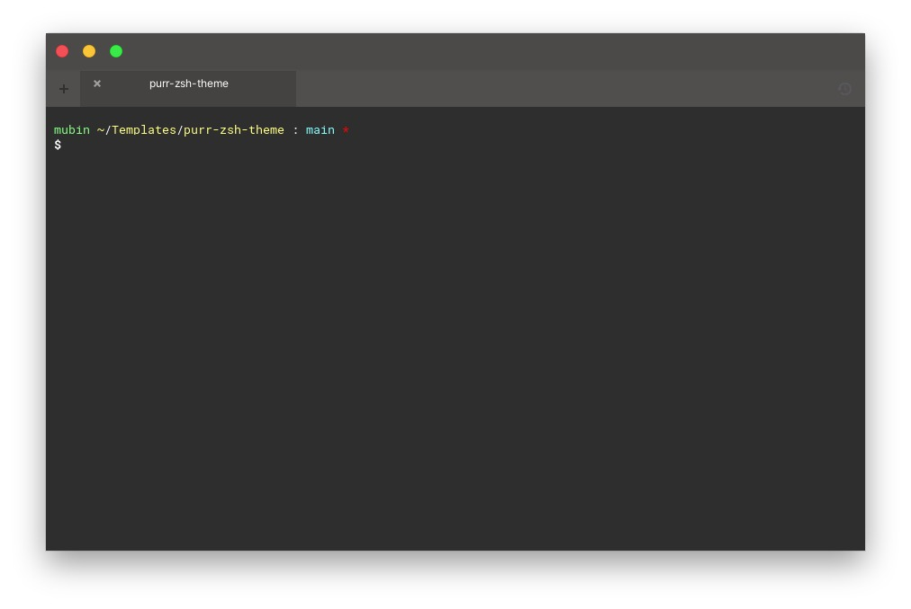

# PURR-ZSH-THEME

## Preview


## Requirement
- `curl`
- `zsh`
- `oh-my-zsh` install by [github](https://github.com/ohmyzsh/ohmyzsh?tab=readme-ov-file#basic-installation)

## Installation
- Download.
```sh
curl -o $ZSH_CUSTOM/themes/purr.zsh-theme https://raw.githubusercontent.com/mubinben/purr-zsh-theme/main/purr.zsh-theme
```
- Open `~/.zshrc` by text editor.
- Edit `ZSH_THEME`, and save.
```sh
ZSH_THEME="purr"
```
- Close terminal, and open again.
- Done.

## License
Purr-zsh-theme is available under the [MIT license](./LICENSE.txt).