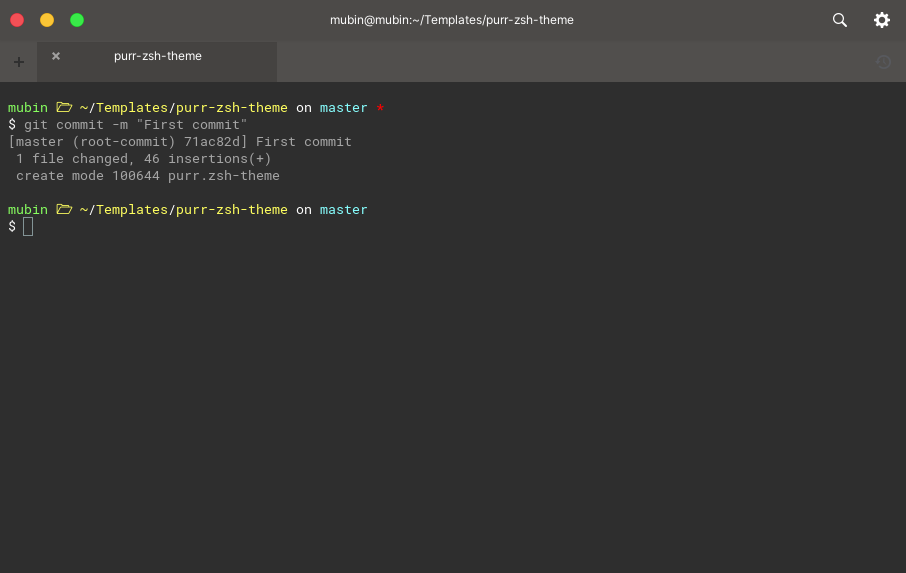

# PURR-ZSH-THEME

## Example



## Dependencies
- `git`
- `zsh`
- `oh-my-zsh` install by github: [oh-my-zsh](https://github.com/ohmyzsh/ohmyzsh#basic-installation)
- `curl` or `wget`

## Installation

**Download project**

Using `crul` or `wget`.

for `curl` :
```sh
curl -o $ZSH_CUSTOM/themes/purr.zsh-theme https://raw.githubusercontent.com/mubinben/purr-zsh-theme/main/purr.zsh-theme
```
for `wget` :
```sh
wget -O $ZSH_CUSTOM/themes/purr.zsh-theme https://raw.githubusercontent.com/mubinben/purr-zsh-theme/main/purr.zsh-theme
```


**Setting new theme**

Open file `.zshrc` by text editor in your terminal.

using `vim` :
```sh
vim ~/.zshrc
```

using `visual studio code` :
```sh
code ~/.zshrc
```

change `ZSH_THEME` following below command :
```sh
ZSH_THEME="purr"
```

save, and close your termianl, then open agian.
Done & enjoy.

## License

Purr-zsh-theme is released under the [MIT license.](LICENSE.md)